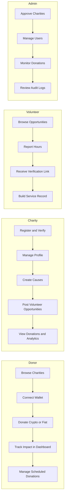

# Give Protocol Web Application

Progressive Web Application for Give Protocol, a Delaware-based 501(c)(3) nonprofit working to leverage technology to remove barriers to sustainable charitable action. This app serves donors, charities, volunteers, and administrators with multi-chain crypto donations, fiat payments, Cause-Specific Impact Fund (CIF) management, and on-chain volunteer attestation.

----

[](https://github.com/GiveProtocolFoundation/give-protocol-webapp/actions/workflows/build.yml) [](https://github.com/GiveProtocolFoundation/give-protocol-webapp/actions/workflows/code-quality.yml) [](https://github.com/GiveProtocolFoundation/give-protocol-webapp/actions/workflows/sonarcloud.yml) [](./LICENSE)


## Features

### For Donors
- **Crypto & Fiat Giving**: Donate via multiple cryptocurrencies or traditional fiat payments
- **Cause-Specific Impact Funds (CIFs)** and **Charitable Equity Funds (CEFs)**: Participate in pooled giving vehicles that spread donations across multiple causes and organizations
- **Dashboard**: Track all donations and recurring contributions at `/give-dashboard`
- **Recurring Donations**: Set up automated monthly or quarterly giving at `/scheduled-donations`
- **Multi-Chain**: Donate across Base, Optimism, Moonbeam, and more

### For Charities
- **Organization Portal**: Manage profile and causes at `/charity-portal`
- **Volunteer Management**: Post opportunities and verify contributions
- **Analytics**: Real-time donation trends and fund performance insights
- **Verification**: Multi-signature security for treasury operations
- **Impact Reporting**: Transparent tracking of fund utilization

### For Volunteers
- **Opportunity Discovery**: Browse verified positions at `/opportunities`
- **Hour Logging**: Self-report contributions; hours are recorded on-chain after charity attestation
- **Contribution Tracking**: View attested service history at `/contributions`
- **Portable Credentials**: Skills and achievements recorded on-chain as charity-attested credentials
- **Skill Endorsement**: Build a portable portfolio of charity-attested expertise

### For Administrators
- **Charity Approval**: Verify and onboard 501(c)(3) organizations
- **User Management**: Handle account creation, roles, and permissions
- **Donation Monitoring**: Real-time transaction oversight
- **Audit Logs**: Complete transparency for compliance
- **Withdrawal Processing**: Manage fund disbursements
## Getting Started

### Prerequisites

- Node.js 20+
- npm
- A Supabase project (for authentication and database)

### Installation

```bash
git clone https://github.com/GiveProtocolFoundation/give-protocol-webapp.git
cd give-protocol-webapp
npm install
```

### Environment Configuration

Copy `.env.example` to `.env` and configure the required variables:

```env
# --- Required ---

# Supabase (authentication and database)
VITE_SUPABASE_URL=https://your-project.supabase.co
VITE_SUPABASE_ANON_KEY=your-anon-key

# Feature flags
VITE_ENABLE_WEB3=true
VITE_SHOW_TESTNETS=false

# --- Smart Contract Addresses (per network) ---
# Each network needs six addresses: Donation, Verification,
# Distribution, PortfolioFunds, Executor, and Token.
# Example for Base Sepolia testnet:
VITE_BASE_SEPOLIA_DONATION_ADDRESS=0x...
VITE_BASE_SEPOLIA_VERIFICATION_ADDRESS=0x...
VITE_BASE_SEPOLIA_DISTRIBUTION_ADDRESS=0x...
VITE_BASE_SEPOLIA_PORTFOLIO_FUNDS_ADDRESS=0x...
VITE_BASE_SEPOLIA_EXECUTOR_ADDRESS=0x...
VITE_BASE_SEPOLIA_TOKEN_ADDRESS=0x...

# Repeat for: OPTIMISM_SEPOLIA, MOONBASE (testnets)
#             BASE, OPTIMISM, MOONBEAM (mainnets)

# --- RPC URLs (optional -- uses server proxy if not set) ---
# Set dedicated provider URLs (Alchemy, Infura) for production.
# VITE_BASE_RPC_URL=https://base-mainnet.g.alchemy.com/v2/YOUR_KEY
# VITE_OPTIMISM_RPC_URL=https://opt-mainnet.g.alchemy.com/v2/YOUR_KEY
# VITE_MOONBEAM_RPC_URL=https://rpc.api.moonbeam.network

# --- Helcim Fiat Payments (frontend flag only) ---
VITE_HELCIM_TEST_MODE=true
# API credentials are server-side secrets set in Supabase Dashboard,
# not in this file. See .env.example for details.

# --- Monitoring (optional) ---
VITE_SENTRY_DSN=
VITE_ENABLE_ANALYTICS=false
```

See `.env.example` for the complete list of variables with documentation.

### Running the Development Server

```bash
npm run dev          # Start Vite dev server at http://localhost:5173
```

## User Flows

The application supports four user roles, each with a dedicated experience:



**Donor:** Register or connect wallet, browse charities at `/browse`, make crypto or fiat donations, track all giving in `/give-dashboard`, manage recurring donations at `/scheduled-donations`.

**Charity:** Register at `/register`, manage organization profile and causes in `/charity-portal`, post volunteer opportunities, view donation analytics and impact reporting.

**Volunteer:** Browse opportunities at `/opportunities`, self-report hours, receive verification links, track contribution history at `/contributions`.

**Admin:** Access `/admin` for charity approval, user management, donation monitoring, withdrawal processing, and audit logs.

## Wallet Integration

The app supports a broad range of wallet providers for EVM-compatible chains:

| Wallet | Type | Notes |
|--------|------|-------|
| MetaMask | Browser extension | Most widely used; auto-detected |
| WalletConnect | Protocol | Connects mobile and desktop wallets |
| Ledger | Hardware | Via @ledgerhq/device-signer-kit-ethereum |
| Safe (Gnosis) | Multisig | Via @safe-global/safe-apps-sdk |
| Coinbase Wallet | Browser/mobile | Native integration |
| Phantom | Browser extension | EVM mode |
| Rabby | Browser extension | Multi-chain |
| Talisman | Browser extension | Polkadot and EVM |
| SubWallet | Browser extension | Polkadot and EVM |

**Wallet features:**
- Auto-detection of installed browser wallets
- Chain switching with user confirmation
- Real-time balance tracking across connected chains
- Transaction signing, submission, and status monitoring
- Wallet disconnect synced with authentication logout

**Supported chains:** Base, Optimism, Moonbeam (mainnets), and their respective testnets (Base Sepolia, Optimism Sepolia, Moonbase Alpha).

## Tech Stack

| Layer | Technology |
|-------|-----------|
| Framework | React 18 + TypeScript 5 |
| Build | Vite 7 (SSR support, code splitting, gzip) |
| Routing | React Router v6 |
| Server state | TanStack React Query v5 |
| Client state | React Context (Auth, Web3, Chain, Settings, Currency, Toast) |
| Styling | TailwindCSS 3 |
| Rich text | Tiptap editor |
| Blockchain | ethers.js v6, viem v2 |
| Database/Auth | Supabase (PostgreSQL, Auth, Realtime) |
| Fiat payments | Helcim (via Supabase Edge Functions) |
| Monitoring | Sentry 9, custom performance monitoring |
| Testing | Jest 30 (unit), Cypress 13 (E2E) |
| Code quality | ESLint 8, SonarCloud, DeepSource |

### State Management

- **React Query** handles all server/async state: API responses, caching, background refetch, optimistic updates.
- **React Context** handles client-only state: authenticated user, active wallet/chain, UI preferences, toast notifications.
- No external state management library (Redux, Zustand, etc.) is used. React Query covers the complexity that would traditionally require one.

## Scripts

```bash
# Development
npm run dev              # Vite dev server with SSR (port 5173)
npm run dev:spa          # SPA mode (no SSR)

# Build
npm run build            # Production build (client + SSR server)
npm run build:spa        # SPA-only build (for Netlify)
npm run preview          # Preview production build locally

# Quality
npm run lint             # ESLint (max 200 warnings)
npm run test             # Jest unit tests
npm run test:e2e         # Cypress E2E (interactive)
npm run test:e2e:headless # Cypress headless
```

## Project Structure

```
src/
├── pages/                # Route-level components
│   ├── Home.tsx          # Landing page
│   ├── Login.tsx         # Authentication
│   ├── GiveDashboard.tsx # Donor dashboard
│   ├── CharityPortal.tsx # Charity management
│   ├── CharityBrowser.tsx
│   ├── VolunteerOpportunities.tsx
│   └── admin/            # Admin panel
├── components/           # Feature-organized components
│   ├── web3/             # Wallet, donation, withdrawal UIs
│   ├── charity/          # Charity cards, profiles, portfolios
│   ├── donor/            # Donor-specific components
│   ├── volunteer/        # Volunteer components
│   ├── auth/             # Login, registration forms
│   └── ui/               # Reusable primitives (Button, Input, Card)
├── contexts/             # React Context providers
├── hooks/                # Custom hooks (useAuth, useWallet, useMultiChain)
├── services/             # API and business logic
├── config/               # Environment, contracts, chains, tokens
├── lib/                  # External integrations (Supabase, Sentry)
├── utils/                # Formatters, validation, security
├── types/                # TypeScript type definitions
├── contracts/            # Smart contract ABIs
├── routes/               # Route definitions and guards
└── i18n/                 # Internationalization
supabase/
└── functions/            # Supabase Edge Functions (Deno)
    ├── helcim-pay/       # HelcimPay.js checkout initialization
    ├── helcim-payment/   # Payment processing
    ├── helcim-subscription/ # Recurring fiat donations
    └── helcim-validate/  # Payment validation
```

## Deployment

### Vercel (Primary)

Deployment is configured in `vercel.json` with SSR support, security headers (CSP, HSTS, X-Frame-Options), SPA rewrites, and long-lived cache headers for static assets.

```bash
npm run build
vercel deploy --prod
```

### Netlify (Alternative)

Configured in `netlify.toml`. Uses SPA mode (no SSR).

```bash
npm run build:spa
netlify deploy --prod --dir=dist
```

### Self-Hosted (Nginx)

An `nginx.conf` is provided for self-hosted deployments with SSL, gzip, and SPA fallback routing.

### Docker

```bash
docker build -t give-protocol-webapp .
docker run -p 3000:5173 give-protocol-webapp
```

## Repository Context

This is the **webapp** repository in the Give Protocol multi-repo architecture:

| Repository | Purpose |
|------------|---------|
| [give-protocol-webapp](https://github.com/GiveProtocolFoundation/give-protocol-webapp) | React web application (this repo) |
| [give-protocol-backend](https://github.com/GiveProtocolFoundation/give-protocol-backend) | Database and admin |
| [give-protocol-contracts](https://github.com/GiveProtocolFoundation/give-protocol-contracts) | Smart contracts |
| [give-protocol-docs](https://github.com/GiveProtocolFoundation/give-protocol-docs) | Documentation site |

**Boundary rules:** Database schema migrations go in the backend repo. Edge functions (Deno) go in this repo under `supabase/functions/`. Smart contracts go in the contracts repo. 


## License

This Give Protocol webapp is licensed under the MIT License.

Our values: We believe philanthropic infrastructure should be
open and accessible. While we don't require it, we ask that
projects adapting this code consider:
- Contributing improvements back to the community
- Acknowledging the Give Protocol Foundation
- Maintaining transparency in how they use this infrastructure
